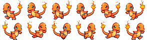

# JS | Sprite Animation

We can create really cool animations using JavaScript and HTML5 Canvas. To create our 2D animation we will use Sprites.

## Sprite

Sprite is a normal 2D bitmap image that is considered as a single frame of our animation.

## Sprite Sheet

When we join together many sprites into a single bitmap we get a spritesheet. So to create a spritesheet we can use any image editing tools like photoshop, gimp etc. But if you are not good at these, just google image search with the keyword “Spritesheet” and you will get many spritesheets.

## Starter code

The main thing we need is a SpriteSheet. So we have the following spritesheet.



As you can see in the image above we have 6 columns and 2 rows. The first row is for right movement and the second row is for left.

When our character is moving rightward then we have to display all the 6 sprites one by one repeatedly. Then it will create an animation.

## Step by step

- Creating an Image object for our character and setting the source to the image file.

```js
  var character = new Image();
  character.src = 'img/character.png';
```

- Setting the width and height of our spritesheet.

```js
  var spriteWidth = 294;
  var spriteHeight = 80;
```

- Rows and cols in the current spritesheet.

```js
  var rows = 2;
  var cols = 6;
```

- Define the rows by movement.

```js
  var trackRight = 0;
  var trackLeft = 1;
```

- To get the width of a single sprite we divided the width of sprite with the number of cols.

```js
  var widthFrame = spriteWidth/cols;
  var heightFrame = spriteHeight/rows;
```

- Each row contains 6 frames and at the start we will display the first frame (assuming the index from 0).

```js
  var currentFrame = 0;
  var frameCount = 6;
```

- Setting x and y coordinates to render the sprite.

```js
  var x = 0;
  var y = 0;
```

- Setting x and y coordinates of the canvas to get the single frame.

```js
  var srcX = 0;
  var srcY = 0;
```

- Now we will create a function to update the frame index. As you can see a variable named `currentFrame` which is initialized with 0. We have to update it each time we will render a the sprite. So we create a function named `updateFrame()`.

  ** We have to clear the current draw sprite before rendering the new sprite. For this we will use the `clearRect` method.

```js
  function updateFrame(){
    ctx.clearRect(x, y, widthFrame, heightFrame);
    currentFrame = ++currentFrame % frameCount;
    srcX = currentFrame * widthFrame;
  }
```

- Finally we will create the function to render the sprite. We render the image using `drawImage` method with the context that has been established for the canvas.

```js
  function draw() {
    updateFrame();
    ctx.drawImage(character, srcX, srcY, widthFrame, heightFrame, x, y, widthFrame, heightFrame);
  }
```

- We need to call the draw function repeatedly to continue rendering the sprites on the canvas. This can be done easily by using `setInterval` method. The first parameter is the function that we want to call (draw), and the second parameter is the interval to call the function. So the above statement will call the draw function after every 100ms.

```js
  setInterval(draw, 100);
```

That's it, happy coding! 🤓

## Extra Resources

- [Spritesheet resource](https://www.spriters-resource.com)
- [Editor for animated sprites & pixel art](https://www.piskelapp.com/)
- [Tutorial Spritesheet Animation](https://gamedevelopment.tutsplus.com/tutorials/an-introduction-to-spritesheet-animation--gamedev-13099)
